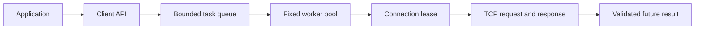

# Architecture

## Request path

The client copies or serializes request arguments before queueing work. Worker tasks capture shared pool ownership and owned request bytes, avoiding references to a destroyed client or caller-owned strings. A fixed number of workers limits concurrent tasks. When the waiting queue is full, the returned future contains an `overloaded` error.

Each worker acquires one exclusive TCP connection for the whole request/response exchange. Requests on a connection are sequential. Different connections can run concurrently. Clients do not multiplex requests or promise submission-order execution.

## Transport and connection ownership

`TcpConnection` owns one noncopyable socket. Sockets use nonblocking mode and `poll` with monotonic deadlines. Successful connection establishment starts the request I/O budget; reused connections start a new budget at acquisition. Interrupted operations retry within the same budget. Partial sends and receives advance byte offsets. EOF, timeout, or a terminal socket error closes the descriptor.

`ConnectionPool` stores idle sockets in shared state protected by a mutex. An acquired connection has a custom deleter that returns it to that state. The deleter never accesses the pool wrapper. Closing the pool clears idle connections and wakes waiting callers. Outstanding leases remain usable and delete their sockets when released.

A protocol or deserialization failure also closes the connection: bytes remaining in a malformed response must not become the next request's response. A stale idle connection can fail its next request; a subsequent call creates a replacement connection. The failed request is not retried.

## Serialization and protocols

The generic serializer handles arithmetic values and strings without external code generation. Integer and IEEE 754 representations use little-endian byte order, and strings carry a 32-bit length. Fixed-width signed integers assume two's-complement representation. Booleans use a validated byte of `0` or `1`.

KVCache uses a separate big-endian header followed by raw key and value bytes. Its shared definition is in `include/kvrpc/kv_protocol.h`. The server's legacy `protocol.h` forwards to that definition. Neither protocol is self-describing, authenticated, or encrypted.

## Server execution

The bundled server uses one nonblocking `poll` event loop. It keeps a bounded set of peers and bounded input/output buffers. Each iteration performs bounded reads and accepts; partial responses remain queued until they can be sent. Complete buffered requests are processed in connection order. Incomplete requests expire under a fixed connection deadline.

Application handlers execute serially in the event loop. This intentionally makes mutation order and persistence order agree. It also means synchronous filesystem operations can delay all clients. The server does not claim the throughput of an asynchronous storage engine.

`CacheService` validates complete frames and coordinates the cache with its log. Each acknowledged mutation follows this sequence:

1. Append the complete mutation record.
2. Synchronize the log with `fsync`.
3. Apply the operation to the in-memory cache.
4. Return a complete protocol acknowledgement.

A mutation failure marks the service unavailable. Later requests are rejected until the service is restarted after the underlying problem is resolved. This prevents reads from silently exposing a cache state that diverges from a partially written log.

## Cache and recovery semantics

`ShardedCache` divides the configured entry capacity across shards without rounding above the total. Each shard applies LRU eviction independently. Hot shards can evict entries while other shards have free capacity. Cache capacity is measured in entries; maximum value size remains a separate protocol limit.

AOF replay validates headers and complete bodies before applying each record. The log is held under an exclusive process lock. Startup rejects truncated records, invalid commands, and oversized records instead of silently accepting partial data.

Reads update LRU ordering but are not logged. Replaying writes may therefore produce different eviction choices from the pre-restart process. Persistence reconstructs a bounded cache; it does not turn the cache into an unbounded durable database.

## Shutdown

Client destruction stops admission, drains queued work, and joins worker threads before releasing its pool reference. The server blocks termination signals and handles them on a dedicated waiting thread. `stop()` only signals the event loop; descriptors are closed by their owning thread when the loop exits. Process shutdown finishes the current synchronous handler, then closes peers. It does not guarantee delivery of every queued acknowledgement.

Filesystem calls have operating-system-dependent latency. A storage device that stalls inside `fsync` can delay shutdown beyond socket deadlines. Supervisors must account for this when selecting termination grace periods.
