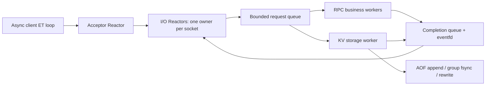

# Architecture

## Event ownership

`EventLoop` uses epoll with EPOLLET and an eventfd wakeup. Descriptor watches use monotonically allocated tokens, so events from a closed/reused fd do not address the new connection. Callbacks and timers execute on the owning loop. Cross-thread work is posted through a mutex-protected task queue. Deadline timers use an ordered tree with indexed cancellation; completed requests do not leave uncancelled timer entries accumulating until their old deadlines.

The acceptor assigns connections round-robin to configurable I/O reactors. Accepts have a per-dispatch budget; reaching it posts a continuation. I/O has a 256 KiB dispatch budget and explicit continuation before EAGAIN. This preserves ET progress without allowing one ready socket to monopolize the thread. Read/write buffers survive partial operations. Input consumption advances a cursor and compacts only when appropriate.

A connection pauses reading when its in-flight allowance or output high-water threshold is reached. Completion directly pumps the socket before resuming readiness interest. The output hard limit closes a connection whose results exceed its budget. Queue overload closes the submitting connection and increments rejection counters. Half-closed writers receive completed responses before closing. Idle/incomplete/blocked connections expire on a configurable deadline; socket ownership remains with the I/O thread.

## Execution

Generic RPC extracts complete frames before queueing owned request bytes. A fixed business pool executes callbacks concurrently. Responses include request IDs and can be sent in completion order. Applications synchronize mutable callback state; registration must finish before starting.

The KV server sets per-connection pipeline execution to one. Its single storage worker takes up to 64 queued requests per group. It validates each frame, appends mutations, performs the shared fsync barrier, applies operations in batch order, and posts responses to the owning I/O loops. Mixed reads still wait for their batch's durability barrier. The always baseline also uses one storage worker but executes one request per job.

The service mutex protects its public synchronous embedding API and snapshots. It intentionally preserves one KV serialization order. Shards provide per-shard LRU/capacity accounting; the current KV executor does not claim parallel shard execution. Network concurrency and generic callback concurrency are independent of this storage ordering.

## Client transport

Each `RpcClient`/`KVCacheClient` owns one EventLoop thread driving a bounded set of lazily established persistent sockets. Admission is limited by outstanding count and serialized bytes, including queued requests. A request deadline starts before posting to the loop. Connect timeout is an additional upper bound within the overall deadline.

RPC maintains an ID-to-promise map, permits multiple requests per connection, and matches out-of-order responses. A fully sent RPC that expires is retired individually; its late response is discarded. Retired IDs still occupy the connection's in-flight allowance until the response arrives, keeping their memory bounded. A timeout during transmission closes the connection to avoid leaving a partial frame in the stream. Connection errors fail all calls on that connection. Invalid decoded responses close the connection before admitting further work. There are no automatic retries.

KV's compatibility protocol has no IDs, so it runs one outstanding request per connection, with concurrency across its sockets. The event loop still handles all waiting without dedicated worker threads. `ClientOptions::workers` is retained for the standalone Executor API; asynchronous clients do not use it.

Legacy pool-taking constructors copy endpoint settings; they do not share leases or pool closure. New code uses `ClientEndpoint`. Synchronous TcpConnection helpers also use epoll and monotonic deadlines.

## Cache and persistence

Cache capacity is partitioned across shards without rounding up total entry/byte budgets. Accounted bytes include key/value payload and entry metadata; allocator/hash-table overhead is not an RSS guarantee. LRU access expires entries lazily and updates ordering. Snapshots filter expired entries and visit each shard oldest-first.

TTL is converted from a relative duration to absolute Unix milliseconds before logging. Replay does not extend TTL; it depends on wall-clock correctness. Existing unexpired values survive a rewrite with their expiration preserved. New AOF records wrap the KV mutation with AOF2 magic, length, and CRC32. Replay validates structure and checksum before applying each record. A corrupt/truncated log fails startup.

Rewrite serializes a snapshot on the storage worker, fsyncs a temporary file in the same directory, atomically renames it over the AOF, and fsyncs the directory. A stable sidecar lock plus the data-file lock prevent another writer during replacement. Stale unreferenced rewrite files after a crash are not replayed. Automatic rewrite runs near the configured byte limit; it pauses KV execution, but never the network reactors. A snapshot/batch that still does not fit is rejected without poisoning reads. Actual write/fsync failures leave storage unavailable until restart and repair.

Group commit is not an atomic multi-operation transaction. Process death can leave unacknowledged records on disk; strict replay rejects a partial final record. Reads and automatic evictions between snapshots are not logged, so replay can change which keys remain resident. Snapshots preserve their captured ordering, not subsequent unlogged read history.

## Shutdown

Stop wakes the acceptor through eventfd. Admission to the business/storage queue closes; workers finish queued jobs and join. I/O reactors process posted completions and close connections on their own threads. Delivery of every response is not guaranteed. A filesystem call or application callback that never returns can delay worker shutdown; deadlines cancel network requests, not arbitrary C++ code.
