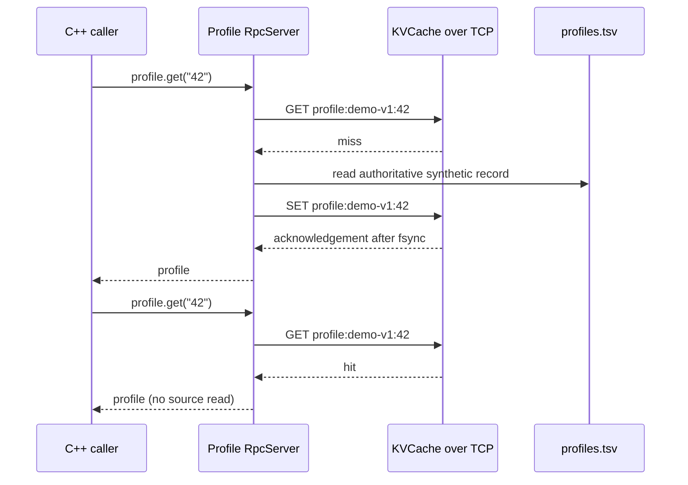

# Read-through profile lookup

The runnable example combines both protocols in an application:



Build normally, start `kv_server`, then run:

```sh
./build/release/profile_demo 8080 examples/profiles.tsv demo-v1
```

The executable verifies three RPC lookups cause two source reads: the second lookup hits the cache,
and an explicit invalidation before the third causes a reload. Both persistence-mode integration
tests execute this application against their own real KV server.

The TSV is an immutable synthetic snapshot, not a simulated production database metric. Changing
its contents requires changing the revision argument or invalidating the corresponding keys. A cache
lookup/write failure falls back to the source; an invalidation failure remains visible to the caller.
Empty profiles are disallowed in this example because KV version 1 cannot distinguish an empty value
from a miss. Missing source records are reported as remote handler failures.

This is a small service integration example, not a production profile API. Its RPC handlers execute
serially, and it does not claim TTL, distributed cache coherence, stampede prevention, authentication,
or source-database transactions. The value demonstrated here is the end-to-end data path, an explicit
source of truth, invalidation, and a measurable reduction in source reads.
